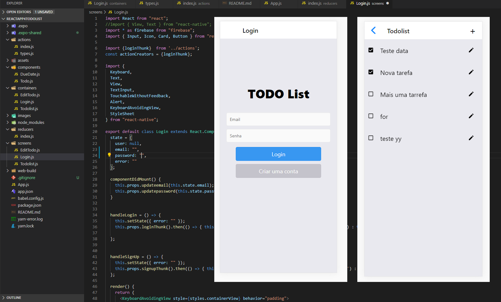

# TodoList com Firebase, Redux e Thunk

Welcome APP!

Tarefa 4 - Firebase, Redux e Thunk	

expo install react-navigation@2.5.1 react-native-gesture-handler@1.3.0 react-native-reanimated@1.2.0
	

Alterar o código-fonte da aplicação TODO (https://snack.expo.io/Sk7mMxbnV) para os seguinte requisitos:

1 - Configurar e utilizar um projeto/app próprio no Firebase;  ✅

2 - Tirar a dependencia de DatePickerAndroid e TimePickerAndroid para a aplicação funcionar em qualquer plataforma; ✅

Foi usado: https://docs.expo.io/versions/latest/sdk/date-time-picker/

<h4 class="css-1l3zmkw" data-heading="true">Platform Compatibility</h4>
<table>
<thead>
<tr><th>Android Device</th><th>Android Emulator</th><th>iOS Device</th><th>iOS Simulator</th><th>Web</th></tr>
</thead>
<tbody>
<tr>
<td class="css-113abxe" title="Android Device is supported">✅</td>
<td class="css-113abxe" title="Android Emulator is supported">✅</td>
<td class="css-113abxe" title="iOS Device is supported">✅</td>
<td class="css-113abxe" title="iOS Simulator is supported">✅</td>
<td class="css-113abxe" title="Web is not supported">❌</td>
</tr>
</tbody>
</table>

3- Implementar em "screens/Login.js" o uso de Redux. O código de acesso ao Firebase deve ser removido; ✅

4 - Estudar e implementar algum recurso do Thunk no aplicativo; ✅ 
```jsx
// redux-thunk é um middleware que permite que as ações do Redux retornem operações assíncronas
// Uma thunk envolve uma expressão para atrasar sua avaliação.
export const loginThunk = () => {
    return async (dispatch, getState) => {
        try {
            const response = await firebase.auth().signInWithEmailAndPassword(getState().email, getState().password)
            dispatch({ type: LOGIN, payload: response.user });
        } catch (e) {
          dispatch({ type: ERROR, payload: e });
        }
    }
}

// redux-thunk é um middleware que permite que as ações do Redux retornem operações assíncronas
export const signupThunk = () => {
    return async (dispatch, getState) => {
        try {
            const response = await firebase.auth().createUserWithEmailAndPassword(getState().email, getState().password);
            dispatch({ type: SIGNUP, payload: response.user });
        } catch (e) {
          dispatch({ type: ERROR, payload: e });
        }
    }
}
```


Implementado com:
When you're ready to see everything that Expo provides (or if you want to use your own editor) you can **Export** your project and use it with [expo-cli](https://docs.expo.io/versions/latest/introduction/installation.html).


# Tela

<p align="center">
	<br>
	
      <br>
</p>
